# UC-Crux-LLVM

UC-Crux-LLVM is a tool for under-constrained symbolic execution of C programs.
It can be used to:

- find undefined behavior and failing assertions,
- verify the absence of undefined behavior and failing assertions,
- deduce sufficient function preconditions to avoid undefined behavior, and
- check two versions of a program for crash-equivalence.

Read more about UC-Crux at https://galois.com/blog/2021/10/under-constrained-symbolic-execution-with-crucible/.

**UC-Crux-LLVM is still in development.**

## Demo

<!-- NOTE(lb) These programs are in the test suite as double_free.c and not_double_free.c --->

<!-- TODO(lb) The printouts from the tool leave a lot to be desired here... --->

`uc-crux-llvm` can use symbolic execution to find the potential double-free in this program:
```c
#include <stdlib.h>
void free_if_even(int *ptr, x) {
  if (x % 2 == 0) {
    free(ptr);
  }
}

void free_if_multiple_of_three(int *ptr, x) {
  if (x % 3 == 0) {
    free(ptr);
  }
}

void double_free(int* ptr, int x) {
  free_if_even(ptr, x);
  free_if_multiple_of_three(ptr, x);  // bug: double free if x % 6 == 0
}
```
```
$ uc-crux-llvm --entry-points double_free double_free.c
[Crux] Attempting to prove verification conditions.
[Crux] Attempting to prove verification conditions.
[UC-Crux-LLVM] Results for double_free
[UC-Crux-LLVM] Found likely bugs:
[UC-Crux-LLVM] Double free at double_free.c:10:5
```
That's not too impressive, a simple linter might be able to find that bug. However, since `uc-crux-llvm` uses symbolic execution, it can precisely conclude that the following program _does not_ have a potential double-free (or _any_ other undefined behavior), provided that it's passed a non-null pointer:
```c
#include <stdlib.h>
void free_if_even(int *ptr, int x) {
  if (x % 2 == 0) {
    free(ptr);
  }
}

void free_if_odd(int *ptr, int x) {
  if ((x + 1) % 2 == 0) {
    free(ptr);
  }
}

void not_double_free(int *ptr, int x) {
  free_if_even(ptr, x);
  free_if_odd(ptr, x); // safe: x can't be both even and odd
}
```
```
$ uc-crux-llvm --entry-points not_double_free not_double_free.c
[Crux] Attempting to prove verification conditions.
[Crux] Attempting to prove verification conditions.
[UC-Crux-LLVM] Results for not_double_free
[UC-Crux-LLVM] Function is safe if deduced preconditions are met:
[UC-Crux-LLVM] Arguments:
[UC-Crux-LLVM]   A pointer to uninitialized space for 1 elements:
[UC-Crux-LLVM]   An integer:
[UC-Crux-LLVM] Globals:
[UC-Crux-LLVM] Return values of skipped functions:
```
While the examples here have very simple inputs, `uc-crux-llvm` is capable of synthesizing much richer inputs, including nested and recursive structs, pointers, floats, and more.

## How It Works



Once a target function has been selected (either by the user or in [Exploratory
Mode](#Exploratory-Mode)), `uc-crux-llvm` will generate the smallest possible
fully symbolic input for that function based on its type signature.
`uc-crux-llvm` will symbolically execute the function on this input, and
iteratively expand it:

- If the symbolic execution succeeded with no safety condition violations,
  it will increase the input depth (up to the user-specified bound) and execute
  it again.

- If some safety conditions were (potentially) violated, the `uc-crux-llvm` will
  examine the error, and either:

  - report it (and optionally continue executing to find other problems), or
  - use heuristics to decide that the error was likely a false positive (i.e.,
    due to a unsatisfied precondition, such as an uninitialized global
    variable). The tool may then use further heuristics to generate inputs or a
    program state/memory layout that satisfies the precondition, such as

    - Allocating memory to back previously unmapped pointers in arguments
    - Expanding the sizes of allocations
    - Initializing global variables

This approach is fairly different from UC-KLEE, which uses "lazy
initialization", i.e., allocating memory *as it's used* by the program.

See this blog post for more details: https://galois.com/blog/2021/10/under-constrained-symbolic-execution-with-crucible/.

## Building

### Prerequisites

Before running `uc-crux-llvm`, you'll need to install the following software:

* GHC and `cabal`. We recommend using `ghcup`:
  <https://www.haskell.org/ghcup/>

* The Yices SMT solver: <http://yices.csl.sri.com/>

* The Z3 SMT solver: <https://github.com/Z3Prover/z3/releases>

* The Clang compiler: <http://releases.llvm.org/download.html>

We recommend Yices 2.6.x, and Z3 4.8.x. Technically, only one of Yices or Z3 is
required, and CVC4 will work, as well. However, in practice, having both tends
to be convenient. Finally, LLVM versions from 3.6 through 14 are likely to work
well, and any failures with versions in that range should be considered
[bugs](https://github.com/GaloisInc/crucible/issues).

### Building

The `uc-crux-llvm` tool can be built by doing the following:

* Clone the enclosing `crucible` repository:

        git clone --recurse-submodules https://github.com/GaloisInc/crucible.git

* Change to the `uc-crux-llvm` directory and run the build script:

        cd crucible/uc-crux-llvm
        cabal v2-build

This will compile `uc-crux-llvm` and supporting libraries such that they can be
executed with `cabal v2-run`. To install the binaries in the standard Cabal
binary path, run the following:

        cabal v2-install exe:uc-crux-llvm --overwrite-policy=always

You can also use the `--installdir` flag to install binaries in a different
location.

## Usage

### Targeted Mode

To run `uc-crux-llvm` on a few specific functions, use the `--entry-points` flag:
```
$ uc-crux-llvm --entry-points deref_arg_const_index test/programs/deref_arg_const_index.c
[CLANG] clang "-c" "-DCRUCIBLE" "-emit-llvm" "-g" "-I" "test/programs" "-I" "/some-path/c-src/includes" "-O1" "-o" "crux-build/deref_arg_const_index.bc" "test/programs/deref_arg_const_index.c"
[Crux] Attempting to prove verification conditions.
[Crux] Attempting to prove verification conditions.
[Crux] Results for deref_arg_const_index
[Crux] Function is safe if deduced preconditions are met:
Arguments:
  A pointer to initialized space for 25 elements:
```
For context, the `deref_arg_const_index` function looks like this:
```c
int deref_arg_const_index(int *ptr) { return ptr[24]; }
```
To understand what the tool is checking, try increasing the verbosity with `-v 2`.

### Exploratory Mode

In addition to exploring a few particular functions, `uc-crux-llvm` has an
"exploratory" mode that will attempt to find bugs in (or prove safe) arbitrary
functions in an LLVM program.

- The `--explore` flag enables this mode.
- The `--explore-budget` flag determines how many functions should be explored.
- The `--no-compile` flag specifies that this program has already been compiled to an LLVM bitcode module.
- The exploratory mode leaves logs with more complete reports at `crux-build/<program name>/<function_name>.summary.log`. By default, it won't re-explore functions that already have such a log. You can force it to revisit functions by passing the `--re-explore` flag.
```
$ uc-crux-llvm --explore-budget 25 --explore --no-compile --re-explore libpng16.a.bc
[Crux] Overall results:
  Unclear result, errors are either false or true positives: 14
  Function is always safe: 2
True positives:
Missing preconditions:
  `free` called on an unallocated pointer in argument: 1
  `free` called on pointer with nonzero offset in argument: 1
  Write to an unmapped pointer in argument: 6
  Read from an uninitialized pointer in argument: 1
  Read from an uninitialized pointer calculated from a pointer in argument: 23
  Addition of a constant offset to a pointer in argument: 21
Unimplemented features:
  Arrays in globals or arguments: 9
Uncertain results:
  Unclassified errors: 65
    Unfixable errors:
    Unfixed errors:
  Missing annotations: 1
  Symbolically failing assertions: 1
```

### Crash-Equivalence Checking

UC-Crux-LLVM can check two different versions of the same program (or two
implementations of the same interface) for *crash-equivalence*, meaning
the two implementations are considered the same unless UC-Crux-LLVM can find a
bug in one but not the other.

The argument to the `--check-ordering` flag is a second program to check for
*crash ordering*, i.e. UC-Crux-LLVM checks that the program passed to
`--check-ordering` has *fewer* crashes than the one passed as an argument. If
the `--crash-equivalence` is also passed to UC-Crux-LLVM, it checks for
*crash-equivalence*. Crash-ordering is a partial order over programs, and
crash-equivalence is an equivalence relation. Use `--entry-points` to check
specific functions, or `--explore` to check all functions from both programs
that share a name.

### Providing Specifications for External Functions

See [./doc/specs.md](./doc/specs.md).

## Developer Documentation

See [./doc/developing.md](./doc/developing.md).
